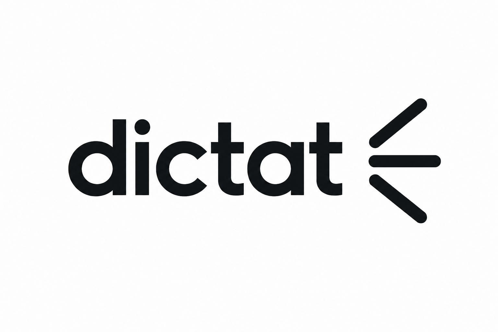

# Dictat

<p align="center">
  
</p>

It's time to delete all your paid subscriptions.

Native macOS **push-to-talk dictation** in the menu bar. Like Wispr Flow, but **free, local, open source**.
Hold a key, speak, release: the transcription (Apple Speech, on-device) is pasted into whatever text
field is focused automatically.

No cloud, no accounts, no paid APIs, no Electron/Python. Apple's on-device Speech by default —
or an optional **local Whisper** engine (via WhisperKit, runs on the Neural Engine) for tougher
vocabulary. Either way the audio never leaves your Mac. Auto-updates and a slick permission flow with
[Sparkle](https://sparkle-project.org) and
[Permiso](https://github.com/zats/permiso).

Lives only in the menu bar. All code in one file:
[`Dictat/Dictat.swift`](Dictat/Dictat.swift).

---

## Install

### Homebrew (recommended)

```bash
brew tap otnakp/dictat            # adds the otnakp/homebrew-dictat tap
brew install --cask dictat
```

Once you install, notice the small microphone icon on the top bar. That's Dictat.

```bash
brew trust otnakp/dictat
brew install --cask dictat
```

### Manual

Download `Dictat.zip` from the [latest release](https://github.com/Otnakp/dictat/releases/latest),
unzip, and drag `Dictat.app` to `/Applications`.

---

## Usage

1. Launch → a `mic` icon appears in the menu bar.
2. Click it and grant the permissions (see below).
3. Two ways to dictate, both always on:
   - **Hold** the key, speak, release → pastes on release.
   - **Double-press** the key to start hands-free, **double-press** again to stop and paste.
4. The text is pasted into the active app (Safari, Chrome, Notes, TextEdit, ChatGPT, …).

Language picker (🇮🇹/🇬🇧) switches both the recognition and the whole UI; default is English.

---

## Engines

Pick the engine in the menu:

- **Apple** (default) — Apple's on-device `SFSpeechRecognizer`. Real, lightweight **live streaming**:
  words appear as you speak. Best for battery. On-device preferred (`requiresOnDeviceRecognition`),
  automatic punctuation.
- **Whisper** (local, via [WhisperKit](https://github.com/argmaxinc/WhisperKit)) — runs OpenAI's Whisper
  on the Neural Engine, fully on-device. Much better at technical terms, code, filenames and anglicisms
  (e.g. *promptare*, *notes.md*). Choose a model (**Small** ~0.5 GB / **Large-v3-turbo** ~1.5 GB); it
  auto-downloads and prewarms on first use, then stays resident (idle = no battery use). **Streaming**
  toggle: on = types live (heavier, continuous inference); off = transcribes once on release (lighter).

## Settings

- **Triggers** — bind up to **5** keys/modifiers, or even **mouse buttons** (side/middle); any one
  activates dictation. Recorded by pressing the key (some mice with custom drivers may not expose buttons).
- **History** — optional (off by default), keeps the last 10 transcriptions to copy from the menu.
- **Auto-updates** — Sparkle checks/installs new versions; toggle in the menu.

---

## Build from source

Requirements: **macOS 14+ (Sonoma)**, **Xcode 15+**. Release build is universal (arm64 + x86_64).

```bash
open Dictat.xcodeproj      # scheme "Dictat", then Cmd+R
```

Debug builds are ad-hoc signed; sandbox is **off** (required for the global CGEvent tap and `Cmd+V`).
Sparkle and WhisperKit are pulled automatically as Swift Package dependencies.


## Troubleshooting

- **Hotkey only works when Dictat is focused** → grant **Input Monitoring**.
- **Doesn't paste** but text is on the clipboard → grant **Accessibility**, or paste manually.
- **Permission toggle won't stick** → stale TCC entries; `tccutil reset Accessibility com.otnakp.dictat` and re-grant.
- **"On-device unavailable"** → the language model isn't installed; turn off "on-device only".
- Some terminals block synthesized paste; copy from the popover and paste manually.

## Notes

Local app: no telemetry, no cloud. With on-device recognition the audio never leaves your Mac.
The clipboard is overwritten with the dictated text (no automatic restore).

MIT licensed — see [LICENSE](LICENSE).
